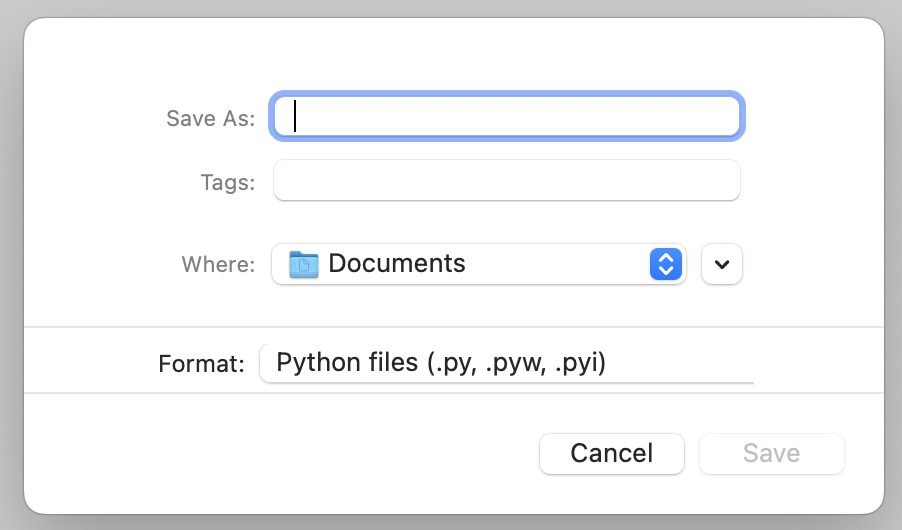
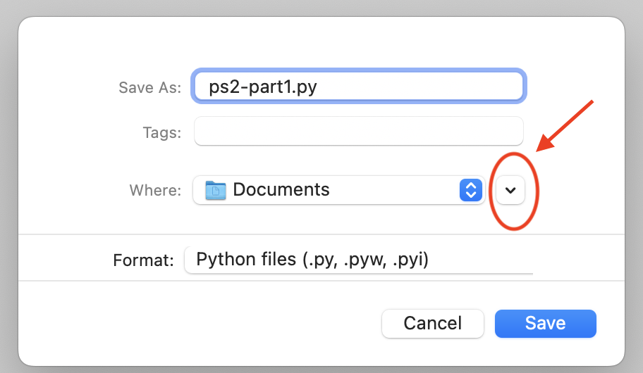

# Problem Set 2
### Due Friday, January 26, 2024, at 11:59pm EST

As with PS1, you will be accessing and submitting this problem set using GitHub Classroom. As a reminder, here's how that goes:

1. Accept the invitation you found on Canvas in Problem Set 2 (which you have already done if you are here).

2. [Read PS1 Part 4 to review how to clone a problem set repository using GitHub Desktop and how to work on it locally.](https://github.com/CSCI1090-S24/ps1/blob/main/README.md#part-4-clone-your-copy-of-the-repository-to-your-own-machine) **As described in PS1, you need to remember where you cloned your repo to on your own machine!**

3. Edit the files on your computer in this repository as described in the sections below.

4. [Reead PS1 Part 9 to review how to submit your work using GitHub Desktop from your local machine up to GitHub on the internet.](https://github.com/CSCI1090-S24/ps1/blob/main/README.md#part-9-commit-your-work-to-github-classroom-using-the-github-desktop-app). Remember that you can commit and push your work as many times as you like. I recommend doing it often so that you have a backup of your work in case your computer breaks!

**NOTE: This respository is nearly empty. That's because you will be creating Python programs yourself, putting them (or creating them) in this directory, and pushing and committing them to GitHub.**

## Part 1

First, you are going to create a Python file in IDLE. Here's how to do that. You will be doing this for parts 2, 3, and 4, as well, so pay attention.

1. Launch IDLE.
2. Go to `File -> New file`. A new window will open.
3. Go to `File -> Save`. A dialog window will pop up where you can enter the name of the Python file and where you want to save it:

5. Enter the file name `ps2-part1.py` in the `Save As` box.

6. Within the dialog box, you now have to navigate to wherever you decided to clone this PS2 repository.  If you're on a Mac and it's giving you limited options where to save your file, click the little arrow circled in the screenshot below. That will give you a real Finder-type window where you can navigate to wherever you saved the repo.

**Recall that I suggest cloning all your GitHub problem set repos to a folder called `DataScience` or `CSCI1090` on your Desktop or in your Documents folder. You can go look in GitHub Desktop to where you actually cloned this repository.**

6. Now you have a Python program you can edit! This is what you should make your program do.

* Ask the user for an integer between 10 and 100. Save that to a variable called `firstnum`.
* Ask the user for a second integer that is less than 4. Save that to a variable called `secondnum`.
* Repeat back to the user the two numbers that they entered.
* Print out their sum and product.
* Print out the first number raised to the power of the second number.
* Print out the remainder you get when you divide the first number by the second number.

7. When you run your program (`Run -> Run module`), your output must look more or less like this.

**IMPORTANT: Save your file and test it after each line of code that you write. When you get an error message, it will be easier to determine exactly when and where you introduced an error if you are only testing a small amount of new code.** 

## Part 2

Create a new file called `ps1-part2.py` just as you did above. This program will do what you did in Part 1, but in a different way, as follows:

1. Write a function called `number_fun()` that takes two integer parameters, `a`, and `b`. The function should:
* Repeat back to the user the two integers that they entered.
* Print out their sum and product.
* Print out the first number raised to the power of the second number.
* Print out the remainder you get when you divide the first number by the second number.

2. **Outside** (after) the function, type code to:

* Ask the user for an integer between 10 and 100. Save that to a variable called `firstnum`.
* Ask the user for a second integer that is less than 4. Save that to a variable called `secondnum`.
* Call the `number_fun()` function, passing in `firstnum` and `secondnum` as the arguments.

When you run your program, your output should look exactly like the output of your program in Part 1.

## Part 3
